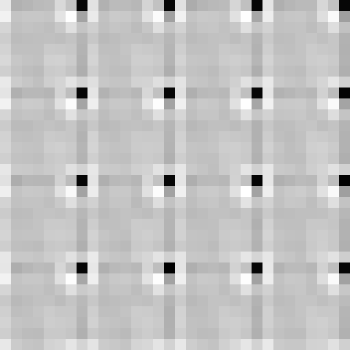

# JPEG Dimples

In [*Photo Forensics from JPEG Dimples*](https://farid.berkeley.edu/downloads/publications/wifs17.pdf), Shruti Agarwal and Hany Farid show that directed rounding of JPEG DCT coefficients can leave a periodic artifact: round-down (floor) produces a darker pixel, round-up (ceil) produces a brighter pixel, and round-to-nearest does not produce the artifact.

- PCE: **153.86**
- Peak phase: **row 0, column 7**
- Peak residual polarity: **dark**

My iPhone uses floor/round-down rounding!

## Reference

Agarwal, Shruti, and Hany Farid. “Photo Forensics from JPEG Dimples.” *2017 IEEE Workshop on Information Forensics and Security (WIFS)*, 2017. [doi:10.1109/WIFS.2017.8267641](https://doi.org/10.1109/WIFS.2017.8267641)
